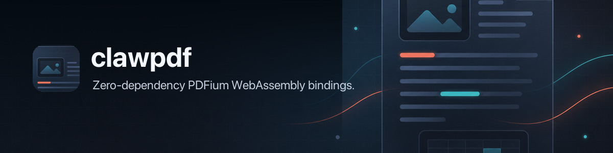

# clawpdf 🦞 — Pull the text and pixels out of PDFs



[](https://github.com/openclaw/clawpdf/actions/workflows/ci.yml)
[](https://www.npmjs.com/package/clawpdf)
[](https://nodejs.org/)
[](LICENSE)
[](https://clawpdf.dev/)

ClawPDF is an ESM-only PDFium WebAssembly library and CLI for Node.js and bundled browser apps. It extracts text, renders pages, and produces PNG bytes without runtime dependencies, native addons, postinstall scripts, or a canvas package.

## Install

```bash
npm install clawpdf
```

Node.js 22 or newer is required. The package includes the `clawpdf` command and its PDFium WebAssembly runtime.

## Quick start

Extract text from a PDF without writing a script:

```console
$ npx clawpdf https://www.w3.org/WAI/ER/tests/xhtml/testfiles/resources/pdf/dummy.pdf
Dummy PDF file
```

Or open a local file from JavaScript and render its first page:

```ts
import { writeFile } from "node:fs/promises";
import { openPdf } from "clawpdf";

await using pdf = await openPdf("report.pdf");
console.log(pdf.text({ maxPages: 5 }));

const png = await pdf.page(1).png({ dpi: 144, forms: true });
await writeFile("page-1.png", png);
```

Page numbers in the CLI and library are one-based.

## CLI

The CLI reads file paths, URLs, and standard input. Text goes to stdout; diagnostics go to stderr.

| Task | Command |
| --- | --- |
| Extract text | `clawpdf report.pdf` |
| Read standard input | `cat report.pdf \| clawpdf -` |
| Emit structured output | `clawpdf report.pdf --json` |
| Render one page | `clawpdf render report.pdf --page 1 -o page.png` |

See the [CLI reference](docs/cli.md) for extraction modes, page selection, passwords, image budgets, inline terminal images, JSON output, and exit codes.

## Text-first extraction

`extractPdf()` can return text, PNG fallback images, or both. In `auto` mode it always extracts text, then renders selected pages only when the text is shorter than `minTextChars`.

```ts
import { extractPdf } from "clawpdf";

const result = await extractPdf("report.pdf", {
  mode: "auto",
  maxPages: 20,
  minTextChars: 200,
  image: { dpi: 96, maxPixels: 4_000_000, forms: true },
});

console.log(result.text, result.images);
```

Image results contain raw PNG bytes. The optional `clawpdf/adapters` export converts them to data URLs or model-message content blocks. See [extraction fallback](docs/extraction-fallback.md) for the modes, limits, and result shape.

## Reuse an engine

`openPdf()` owns a private engine and suits one-off work. Servers should create one engine, reuse it across documents, and dispose it during shutdown:

```ts
import { createEngine } from "clawpdf";

export async function inspect(pdfBytes: Uint8Array) {
  await using engine = await createEngine();
  await using pdf = await engine.open(pdfBytes);

  console.log(pdf.metadata.title);
  console.log(pdf.page(1).text());
}
```

The Node entry point accepts byte arrays, file paths, URLs, and blobs. Bundled browser code should import the pre-wired `clawpdf/browser` entry point; see [browser and bundler setup](docs/browser-bundlers.md).

## Documentation

- [Loading PDFs](docs/loading.md) covers inputs, document lifetimes, and passwords.
- [Text extraction](docs/text-extraction.md), [page rendering](docs/page-rendering.md), and [PNG output](docs/png-output.md) cover the core document APIs.
- [Password-protected PDFs](docs/passwords.md) covers the library and CLI flows.
- [API reference](docs/api-reference.md) lists exports, types, options, and typed errors.
- [Package shape](docs/package-shape.md) records the published files and dependency contract.
- [PDFium provenance](docs/pdfium-provenance.md) records the vendored release, checksum, notices, and refresh workflow.
- [Performance](docs/performance.md) contains the current local benchmark snapshot.

The full documentation site is available at [clawpdf.dev](https://clawpdf.dev/).

## Development

```bash
pnpm install
pnpm build
pnpm typecheck
pnpm test
pnpm test:package
pnpm docs:site
```

CI runs the same checks on Node.js 22, 24, and 26.

## License

MIT. PDFium carries upstream BSD-style and Apache-2.0 notices; see [THIRD_PARTY_NOTICES.md](THIRD_PARTY_NOTICES.md).
